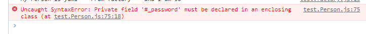

# POO

Programmation Orientée Objet

## Factory, une façon de factoriser son code

Pour ne pas avoir à répéter le même code un nombre incalculable de fois, on peut faire une factory
Une factory est un **objet** qui va nous permettre de créer d'autres objets

## Class : une autre façon de créer les objets et de ne pas répéter

La Class représente une catégorie d'objets, on lui déclare des propriétés et un objet créé par cette classe s'appelle une **instance**

Chaque instance issue de cette classe possèdera ses propriétés.

Définitions :

| ***Class*** | Les ***Class*** sont utilisés pour encapsuler le code donc isoler le code, il s'agit d'une nouvelle façon de créer des objets en respectant la POO |
| -- | -- |
|||
| ***constructor*** | Quand on crée un ***Class***, on va définir un ***constructor*** qui est une méthode spéciale qui permet par ce biais là d'introduire nos **arguments** :   |
||***this*** est utilisé pour se référer à l'objet en cours et permet donc de "stocker" ces arguments dans *this.ClassName*|
||Il ne peut y avoir qu'un seul et unique méthode constructeur dans une ***Class*** sinon ça génère *SyntaxError*|
|||
| ***instances*** | Les ***propriétés*** qu'on va définir sont des objets qui sont créés et qui seront par définitions des ***instances*** |
|***new***| Grâce à ***new*** on va lui passer les valeurs et va appler le constructeur pour mettre le tout dedans|

Visualisation du code  :

```js
//~create Class
class Person {

    //~constructor
    constructor(firstName, lastName, age) {
        this.firstName = firstName;
        this.lastName = lastName;
        this.age = age;

    }

    //~object created : instances
    firstName;
    lastName;
    age;

    //~methods
    sayHello() {
        console.log(`My Person is ${this.firstName} ${this.lastName} and I am ${this.age}`);
    }
}

//~export the module
const yumi2 = new Person('yumi', '---From Class---',30);

//~we can also add property in this way
yumi2.pokemon = 'pikachu';
console.log(yumi2);

//~call the method
yumi2.sayHello()


```

### Résultat des tests


### Getters / Setters



```js
//test
yumi2.password = 'password';
console.log(yumi2.password); //access to the word "password" of property but not THE password

try {
    yumi2.password = 'pass'; //create an error
} catch (error) {
    console.error(error.message);
}
console.log(yumi2.password);

```


CONSEIL : NE PAS OUBLIER D'ENLEVER TOUS LES CONSOLE.LOG  QUAND ON DEPLOIE

## Application de la POO

Quand on crée un fichier avec une classe, on met aussi la majuscule sur le fichier


Ici, si on met console.log alors qu'il y a déjà un console.log dans la méthode, return ***undefined*** parce que ça ne retourne rien


```js
console.log(admin.fullName);
```


 ***instanceof*** sert à identifier à quelle classe appartient notre instance

```js

const user2 = new Admin('Admin', 'Admin', 'admin@admin.com', 'password');
console.log(user instanceof User);
console.log(user instanceof Admin);

console.log(user2 instanceof User);
console.log(user2 instanceof Admin);

```


Comprendre ***extends*** par un exemple

```js
//~create parent Class
class Vehicle {
    //~create instances
    engine;
    brand;

    //~constructor
    constructor(engine, brand) {
        this.engine = engine;
        this.brand = brand;
    }
}

class Car extends Vehicle {
    //~create instances
    wheels;

    constructor(engine, brand, wheels) {
        super(engine, brand);
        this.wheels = wheels;
    }

}

const vehicle = new Vehicle();
const car = new Car("110cv", "Mustang", 4);

console.log(car);
```


```js
class Admin extends User {
    //exemple author
    is_author = false;

    constructor(is_author) {
        this.is_author = is_author
    }
}

------

//^Create instance Admin
const admin = new Admin('Admin', 'Admin', 'admin@admin.com', 'password', true);
//=> ERROOOOR

```


***super()*** nous permet de récupérer le *this* et qui correspondra à la Class parent.


## Info console

