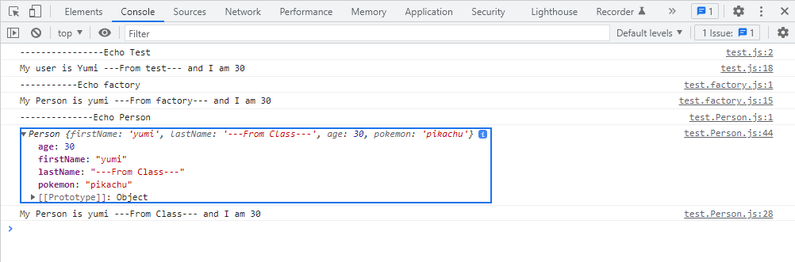

# POO

Programmation Orientée Objet

## Factory

Pour ne pas avoir à répéter le même code un nombre incalculable de fois, on peut faire une factory
Une factory est un **objet** qui va nous permettre de créer d'autres objets

## Class : une autre façon de créer les objets

On lui déclare des propriétés et un objet créé par cette classe s'appelle une **instance**

Chaque instance issue de cette classe possèdera ses propriétés.

Définitions :

| ***Class*** | Les ***Class*** sont utilisés pour encapsuler le code donc isoler le code, il s'agit d'une nouvelle façon de créer des objets en respectant la POO |
| -- | -- |
|||
| ***constructor*** | Quand on crée un ***Class***, on va définir un ***constructor*** qui est une méthode spéciale qui permet par ce biais là d'introduire nos **arguments** :   |
||***this*** est utilisé pour se référer à l'objet en cours et permet donc de "stocker" ces arguments dans *this.ClassName*|
||Il ne peut y avoir qu'un seul et unique méthode constructeur dans une ***Class*** sinon ça génère *SyntaxError*|
|||
| ***instances*** | Les ***propriétés*** qu'on va définir sont des objets qui sont créés et qui seront par définitions des ***instances*** |


Visualisation du code  :

```js
//~create Class
class Person {

    //~constructor
    constructor(firstName, lastName, age) {
        this.firstName = firstName;
        this.lastName = lastName;
        this.age = age;

    }

    //~object created : instances
    firstName;
    lastName;
    age;

    //~methods
    sayHello() {
        console.log(`My Person is ${this.firstName} ${this.lastName} and I am ${this.age}`);
    }
}

//~export the module
const yumi2 = new Person('yumi', '---From Class---',30);

//~we can also add property in this way
yumi2.pokemon = 'pikachu';
console.log(yumi2);

//~call the method
yumi2.sayHello()


```

### Résultat des tests



### Getters / Setters
